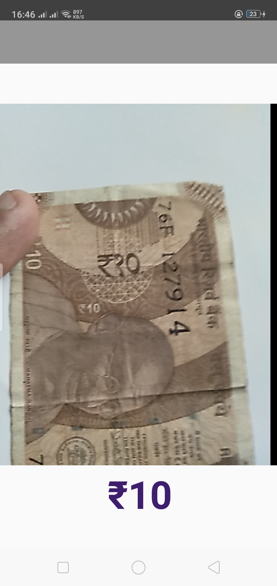

# Third-Eye
The currency detection companian.

## About:
Third-Eye is a Artificial Intellenge based real-time currency classification application for Android mobile devices. It uses a re-trained neural network model works on Tensorflow-lite API. This concept is called transfer learning in Machine learning major.

This application is targeted to Visually impaired or old people who have difficulty in recognizing the currency and suffer loss due to it. All you have to do is place the note in front of camera and tap the screen, the application will provide an audio output containing the amount of money the note contains. Also, there is a fairly large textbox for the people having partial vision.
## Features:
  - Works on Real-time.
  - Can identify many types of Indian currency(notes 10+).
  - Provides audio output of detected amount.
  - Easy User Interface.
  - Optimized and lag free.

## Screenshots:
        

## Technical:
Third-Eye is made using following tools:
* [Android Studio](https://developer.android.com/studio) - It is the official Integrated Development Environment (IDE) for Android app development.
* [Tensorflow](https://www.tensorflow.org/) - An open source Artificial Intellengence library.
### Installation:
 Just clone or download the repository and open the project in Android Studio with Tensorflow installed.
### Development:

* Want to contribute and add a feature ?
   * pull requests and we will be more than happy to merge.
* Have an idea about the application ? 
  * DM us on:
    * [Shashank soni](https://www.linkedin.com/in/shashank-soni-02330a156/)
    * [Kaushal kumar](https://www.linkedin.com/in/kaushal-kumar-7314b214b/)

### Todo:

 - Add flash.
 - Add splash screen.
 - Add information Activity. 
### License:
MIT
#### NOTE:
Audio feature is not yet added to the files. It will be commited soon.

### End of small projects can be the start of something big.!
